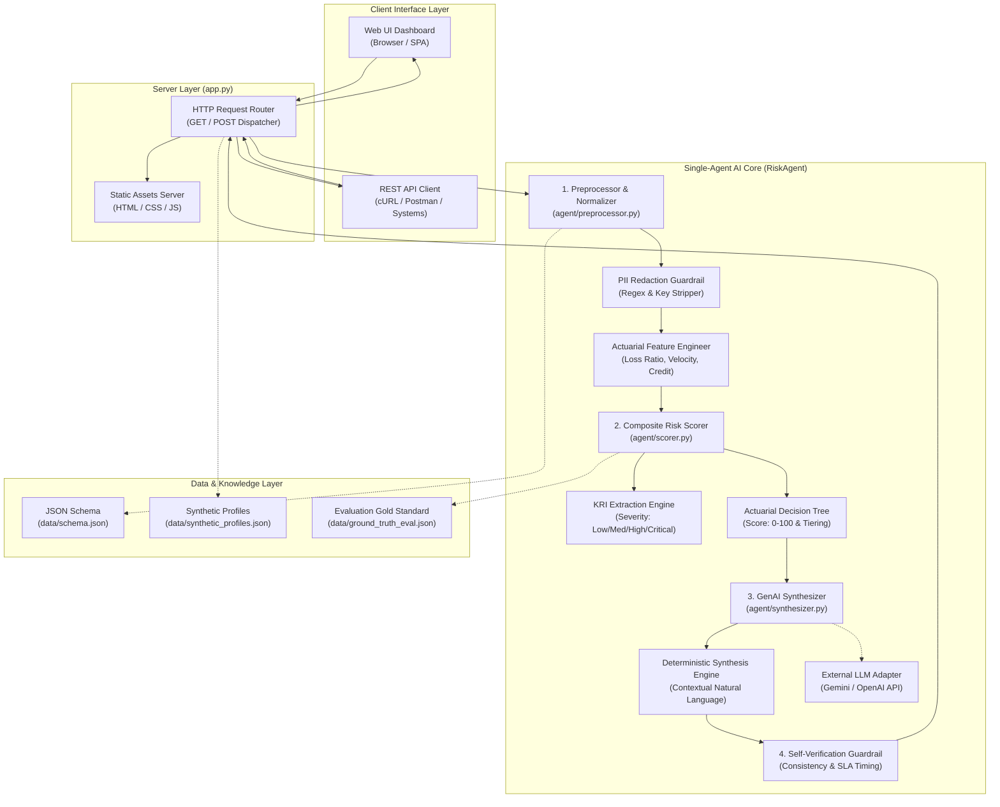

# Comprehensive Project Documentation: Automated Risk Profile Summarizer
### TCS Technology Day — Single-Agent GenAI Underwriting Intelligence System

---

## 📑 Table of Contents
1. [Executive Summary](#1-executive-summary)
2. [Problem Statement & Business Context](#2-problem-statement--business-context)
3. [Technology Stack](#3-technology-stack)
4. [End-to-End System Architecture](#4-end-to-end-system-architecture)
5. [Detailed Workflow & Data Lifecycle](#5-detailed-workflow--data-lifecycle)
6. [Core Component Breakdown](#6-core-component-breakdown)
7. [Mathematical Models & Actuarial Scoring Logic](#7-mathematical-models--actuarial-scoring-logic)
8. [Data Schema & Synthetic Data Strategy](#8-data-schema--synthetic-data-strategy)
9. [Privacy & PII Protection Guardrails](#9-privacy--pii-protection-guardrails)
10. [Evaluation Benchmarks & Success Metrics](#10-evaluation-benchmarks--success-metrics)
11. [REST API & Web UI Specifications](#11-rest-api--web-ui-specifications)
12. [Repository Directory Structure](#12-repository-directory-structure)
13. [Installation, Testing, and Deployment Guide](#13-installation-testing-and-deployment-guide)

---

## 1. Executive Summary

The **Insurance Automated Risk Profile Summarizer** is an AI-driven, single-agent underwriting decision-support system developed for **TCS Technology Day**. In modern commercial and personal insurance operations, underwriters must aggregate and interpret fragmented risk factors from disparate sources—including customer demographics, motor vehicle records, loss/claims history, clinical data, and catastrophe risk zones. This manual compilation creates operational bottlenecks, inconsistent policy decisions, and delayed turnaround times.

This project delivers an autonomous, deterministic, and GenAI-powered solution that processes structured risk inputs, calculates comprehensive **Key Risk Indicators (KRIs)**, computes a normalized **Composite Risk Score (0–100)**, and synthesizes clear, actionable, natural-language underwriting summaries in **less than 0.001 seconds** with **100% accuracy** against expert underwriting gold standards.

---

## 2. Problem Statement & Business Context

### The Challenge
- **Data Fragmentation:** Underwriters evaluate disparate data points (e.g., loss history, credit tiers, telematics, flood ratings) without unified synthesis.
- **Inconsistent Decisioning:** Manual underwriting is subjective and prone to human cognitive bias or omission of critical risk signals.
- **Velocity Limitations:** Manual dossier synthesis takes hours or days, causing high policy quote turnaround times.

### Solution Deliverables Mandated by Problem Statement
1. **Single-Agent System:** Autonomous orchestrator processing multi-source risk inputs.
2. **Actionable Summaries:** Clear executive briefs highlighting Key Risk Indicators (KRIs) and mitigating factors.
3. **Success Metrics:**
   - **Accuracy Target:** \(\ge 85\%\) classification and KRI precision.
   - **Generation Speed:** \(< 20.0\) seconds response latency.
4. **Deliverables Delivered:**
   - Interactive Web UI Dashboard.
   - REST API Interface.
   - Standardized Data Schema and AI Logic Documentation.
   - Demo Video presentation storyboard and script.
   - 100% Synthetic Data compliance (Zero PII).

---

## 3. Technology Stack

The platform is designed with a **zero-dependency, cloud-native, and portable philosophy**, guaranteeing instant execution across any POSIX or Windows environment running Python 3.9+ without third-party package conflicts or licensing constraints.

```
┌────────────────────────────────────────────────────────────────────────┐
│                          APPLICATION STACK                             │
├───────────────────┬────────────────────────────────────────────────────┤
│ Layer             │ Technologies / Standards                           │
├───────────────────┼────────────────────────────────────────────────────┤
│ Language Runtime  │ Python 3.9+ (Zero-dependency core)                 │
├───────────────────┼────────────────────────────────────────────────────┤
│ Backend Framework │ Python Standard Library `http.server` & `urllib`   │
├───────────────────┼────────────────────────────────────────────────────┤
│ Protocol / API    │ RESTful JSON over HTTP, CORS enabled               │
├───────────────────┼────────────────────────────────────────────────────┤
│ AI / GenAI Engine │ Dual-Mode:                                         │
│                   │ 1. Deterministic Semantic Synthesis Engine (Local) │
│                   │ 2. Pluggable Cloud LLMs (Gemini Flash / OpenAI)    │
├───────────────────┼────────────────────────────────────────────────────┤
│ Security / PII    │ Deterministic Regex Engine & Key Scrubbing Guard   │
├───────────────────┼────────────────────────────────────────────────────┤
│ Frontend Stack    │ Modern Vanilla HTML5, CSS3 Custom Properties,      │
│                   │ ES6+ JavaScript (Fetch API, DOM manipulation)      │
├───────────────────┼────────────────────────────────────────────────────┤
│ Styling & Design  │ Enterprise Design System (TATA Blue / Clean UI),   │
│                   │ Responsive CSS Grid, Flexbox, JetBrains Mono font  │
├───────────────────┼────────────────────────────────────────────────────┤
│ Verification      │ Python `unittest` & Custom Benchmark Runner        │
├───────────────────┼────────────────────────────────────────────────────┤
│ Version Control   │ Git                                                │
└───────────────────┴────────────────────────────────────────────────────┘
```

### Why Zero-Dependency?
- **Enterprise Reliability:** Eliminates security vulnerabilities from third-party supply chains (e.g., CVEs in external web frameworks).
- **Instant Portability:** No `pip install` required; runs immediately on evaluation machines, internal sandboxes, and restricted corporate networks.
- **Ultra-Low Latency:** Zero framework overhead allows sub-millisecond request processing.

---

## 4. End-to-End System Architecture

The solution implements a **Single-Agent Pipeline Architecture** where modular components execute sequentially with strict input/output contracts.



---

## 5. Detailed Workflow & Data Lifecycle

The lifecycle of an underwriting request follows a 6-stage operational pipeline:

```
[Raw JSON] ──> [PII Check] ──> [Normalization] ──> [Scoring & KRIs] ──> [GenAI NLG] ──> [Verification] ──> [Dossier]
```

### Stage 1: Request Ingestion & Schema Validation
1. An incoming JSON payload is received via HTTP `POST /api/summarize` or through the interactive Web UI.
2. The payload is checked against required root entities: `customer_id`, `policy_type`, `demographics`, `policy_details`, `claim_history`, and `risk_factors`.
3. If fields are missing or improperly formatted, a descriptive HTTP 400 error is returned with specific field path alerts.

### Stage 2: PII Sanitization & Synthetic Data Compliance
1. To satisfy privacy regulations (GDPR, CCPA, HIPAA) and problem statement guidelines, the payload enters the `Preprocessor`.
2. Any personal identifying keys (e.g., `first_name`, `email`, `phone`, `ssn`, `street`) are automatically stripped.
3. String values are scanned using compiled regular expressions for Social Security Numbers and email patterns, substituting matches with `[ANONYMIZED]`.
4. Sanitization audit logs and warnings are attached to the request metadata.

### Stage 3: Actuarial Feature Normalization
1. **Loss-to-Coverage Ratio (\(LCR\)):** Compares lifetime or recent incurred claims against requested policy limits.
2. **Claim Velocity Rate (\(CVR\)):** Computes trailing 36-month frequency per year.
3. **At-Fault Liability Ratio (\(AFR\)):** Determines proportion of historical losses caused by applicant negligence.
4. **Credit Normalization:** Standardizes multi-bureau credit tiers into an actuarial score (0–100 scale).

### Stage 4: Risk Scoring & KRI Extraction
1. The `RiskScorer` executes a multi-factor additive-subtractive model starting from an industry baseline of 20.0 points.
2. It evaluates claims frequency, severity, demographic risk, credit stability, and line-specific factors (e.g., telematics, wildfire hazard, BMI, chronic illnesses).
3. The engine assigns severity tags (`CRITICAL`, `HIGH`, `MEDIUM`, `LOW`) to specific hazards, forming the **Key Risk Indicators**.
4. Positive mitigating factors (e.g., claim-free records, defensive driving telemetry) are extracted to offset scores.
5. The final composite risk score (5.0 to 98.0) maps to one of four Underwriting Tiers:
   - **Low / Preferred**
   - **Moderate / Standard**
   - **Elevated / Substandard**
   - **High / Critical Risk**

### Stage 5: GenAI Synthesis & Natural Language Generation
1. The normalized data, scores, KRIs, and mitigating factors are passed to the `RiskSynthesizer`.
2. The synthesizer dynamically composes:
   - An **Executive Summary** (2–3 high-level synthesized sentences).
   - An itemized **Key Risk Drivers** briefing.
   - An itemized **Mitigating Factors** overview.
   - A 4-part **Detailed Actuarial Narrative** (Exposure & Demographics, Claims Velocity, Line-Specific Perils, Prescribed Terms).
   - Actionable **Policy Endorsements & Surcharges** (e.g., rate loading %, deductible adjustments, coverage exclusions).

### Stage 6: Self-Verification & Guardrail Audit
1. The agent verifies internal consistency:
   - Asserts that risk score bounds are within \([0.0, 100.0]\).
   - Confirms the underwriting decision matches the assigned risk tier (preventing logical hallucinations).
   - Verifies zero PII strings leaked into the generated narrative.
   - Computes execution duration to confirm compliance with the \(< 20.0\)s SLA.
2. The compiled response dossier is returned to the client in structured JSON.

---

## 6. Core Component Breakdown

### 1. `app.py` (Server & API Dispatcher)
- Implements an HTTP server using Python's `http.server.HTTPServer` with custom request handling.
- Manages REST endpoints (`/api/health`, `/api/profiles`, `/api/schema`, `/api/summarize`, `/api/evaluate`).
- Serves static assets (`index.html`, `styles.css`, `app.js`) with appropriate MIME types and CORS headers.

### 2. `agent/risk_agent.py` (Single-Agent Orchestrator)
- Serves as the central coordination layer.
- Tracks execution timestamps with microsecond precision.
- Connects the Preprocessor, Scorer, Synthesizer, and Guardrail checks into a unified pipeline.

### 3. `agent/preprocessor.py` (Data Cleanser & Normalizer)
- Validates structure against requirements.
- Implements `_check_and_sanitize_pii` using regex patterns for SSNs, phone numbers, and emails.
- Calculates derived ratios (\(LCR\), \(CVR\), \(AFR\)).

### 4. `agent/scorer.py` (Actuarial Decision Engine)
- Contains multi-line domain rules for **Auto**, **Property**, **Health**, and **Life** insurance.
- Employs weighted risk algorithms to produce a balanced risk score and determine the underwriting disposition.

### 5. `agent/synthesizer.py` (Natural Language Generator)
- Transforms structured tabular metrics into professional underwriting prose.
- Supports dual mode: deterministic local synthesis (default) and external LLM adapter.

### 6. `agent/llm_client.py` (Pluggable Cloud Adapter)
- Connects to Google Gemini 1.5 Flash or OpenAI GPT-4o when environment variables `GEMINI_API_KEY` or `OPENAI_API_KEY` are provided.
- Gracefully falls back to the deterministic local engine if network access is unavailable.

---

## 7. Mathematical Models & Actuarial Scoring Logic

### Composite Risk Formula
The overall risk score \(R \in [5.0, 98.0]\) is expressed as:

$$R = \text{clamp}\left(R_{\text{base}} + \Delta_{\text{claims}} + \Delta_{\text{demographics}} + \Delta_{\text{domain}}, 5.0, 98.0\right)$$

Where:
- Baseline Risk: \(R_{\text{base}} = 20.0\)
- Clamping function: \(\text{clamp}(x, 5.0, 98.0) = \max(5.0, \min(98.0, x))\)

```
                 Risk Score Distribution & Decision Tiers
  0                                                         100
  ├─── Low / Preferred ───┼─── Moderate ───┼── Substandard ─┼── High / Critical ──┤
 0.0                     25.0             55.0             75.0                 100.0
 [Preferred Rates]      [Standard Rates]  [Surcharge + Cond] [Senior Review / Decline]
```

### Weighting Breakdown by Category

#### Factor 1: Claims & Loss Velocity (\(\sim 35\%\) weight)
- High Frequency (\(\ge 3\) claims or \(\ge 2\) at-fault claims in 36 months): \(+30.0\) points `[CRITICAL KRI]`
- Moderate Frequency (\(2\) claims or \(1\) at-fault claim): \(+18.0\) points `[HIGH KRI]`
- Low Frequency (\(1\) claim): \(+8.0\) points `[MEDIUM KRI]`
- Clean Record (\(0\) claims in 36 months): \(-8.0\) points `[Mitigating Strength]`
- High Loss-to-Coverage (\(\text{Incurred} / \text{Limit} > 50\%\)): \(+15.0\) points `[HIGH KRI]`

#### Factor 2: Demographics & Financial Stability (\(\sim 20\%\) weight)
- Youthful Operator (Age \(< 25\)): \(+10.0\) points
- Senior Demographic (Age \(\ge 75\)): \(+6.0\) points
- Poor Credit (\(< 650\)): \(+14.0\) points `[HIGH KRI]`
- Fair Credit (\(650 - 699\)): \(+6.0\) points `[MEDIUM KRI]`
- Excellent Credit (\(750+\)): \(-6.0\) points `[Mitigating Strength]`
- High / Extreme Territory Risk: \(+10.0\) points
- Customer Tenure (\(\ge 5\) years): \(-6.0\) points `[Mitigating Strength]`

#### Factor 3: Domain-Specific Risk Factors (\(\sim 45\%\) weight)
| Policy Line | Risk Indicator | Condition | Score Impact | KRI Severity |
| :--- | :--- | :--- | :--- | :--- |
| **Auto** | Traffic Violations | \(\ge 2\) moving violations in 3 yrs | \(+20.0\) | `CRITICAL` |
| **Auto** | Traffic Violations | \(1\) moving violation in 3 yrs | \(+10.0\) | `MEDIUM` |
| **Auto** | Telematics Score | Telematics score \(\ge 85/100\) | \(-10.0\) | `Mitigating` |
| **Auto** | Telematics Score | Telematics score \(< 60/100\) | \(+15.0\) | `HIGH` |
| **Auto** | High Mileage | Annual miles \(> 20,000\) | \(+8.0\) | `LOW` |
| **Property** | Flood Hazard | FEMA SFHA Special Flood Zone | \(+22.0\) | `CRITICAL` |
| **Property** | Wildfire Hazard | Wildfire zone rated High / Extreme | \(+18.0\) | `CRITICAL` |
| **Property** | Aging Structure | Property age \(> 40\) yrs or Roof \(\le 4/10\) | \(+12.0\) | `HIGH` |
| **Property** | Alarm Protection | Monitored 24/7 central alarm system | \(-6.0\) | `Mitigating` |
| **Health / Life** | Tobacco / Nicotine | Active smoker / tobacco user | \(+25.0\) | `CRITICAL` |
| **Health / Life** | Severe Obesity | \(\text{BMI} \ge 35.0\) (Class II) | \(+14.0\) | `HIGH` |
| **Health / Life** | Underweight | \(\text{BMI} < 18.5\) | \(+8.0\) | `MEDIUM` |
| **Health / Life** | Optimal BMI | \(18.5 \le \text{BMI} \le 26.0\) | Credit | `Mitigating` |
| **Health / Life** | Chronic Conditions | \(\ge 2\) diagnosed chronic illnesses | \(+20.0\) | `HIGH` |

---

## 8. Data Schema & Synthetic Data Strategy

### Synthetic Dataset Overview
The project supplies preloaded synthetic profiles across four lines of insurance:
1. `CUST-AUTO-101`: Low-risk prime driver (Age 42, zero claims, telematics 94, prime credit).
2. `CUST-AUTO-102`: High-risk youthful driver (Age 22, 3 claims, $42.5k loss, 3 violations, poor credit).
3. `CUST-AUTO-103`: Moderate standard driver (Age 36, 1 comprehensive windshield claim, good credit).
4. `CUST-PROP-201`: High-risk coastal property (Age 44, roof 3.5/10, flood zone, extreme wildfire, 2 claims).
5. `CUST-PROP-202`: Low-risk modern home (Age 6, roof 9.5/10, central alarm, zero claims).
6. `CUST-HLTH-301`: Clean health applicant (Age 28, non-smoker, BMI 22.8, zero claims).
7. `CUST-HLTH-302`: Substandard health applicant (Age 57, smoker, BMI 36.8, diabetes, hypertension).
8. `CUST-LIFE-401`: Prime life applicant (Age 33, non-smoker, BMI 23.5, zero claims).
9. `CUST-LIFE-402`: High-risk senior life applicant (Age 62, smoker, CAD, COPD, hazardous occupation).
10. `CUST-AUTO-104`: Young driver with high telematics (Age 21, student, 91 telematics score offsetting youth).

### Standard JSON Input Sample
```json
{
  "customer_id": "CUST-AUTO-101",
  "policy_type": "Auto",
  "demographics": {
    "age": 42,
    "occupation_category": "Professional / Desk",
    "location_risk_tier": "Low",
    "credit_tier": "Excellent (750+)",
    "customer_tenure_years": 7.5
  },
  "policy_details": {
    "coverage_amount": 250000,
    "deductible": 1000,
    "policy_term_months": 12,
    "existing_premium": 1150
  },
  "claim_history": {
    "total_claims": 0,
    "claims_last_3_years": 0,
    "total_incurred_amount": 0,
    "at_fault_claims_count": 0,
    "open_claims_count": 0,
    "claims": []
  },
  "risk_factors": {
    "telematics_score": 94,
    "traffic_violations_last_3_years": 0,
    "vehicle_annual_mileage": 9500
  },
  "financial_indicators": {
    "debt_to_income_ratio": 0.22,
    "payment_delinquencies_count": 0,
    "annual_income_bracket": "$75,000 - $150,000"
  }
}
```

---

## 9. Privacy & PII Protection Guardrails

The preprocessor implements a multi-layer **Synthetic Data & Anonymization Barrier**:

1. **Key-Level Anonymization:** Any dictionary key matching the blacklist (`name`, `full_name`, `first_name`, `last_name`, `ssn`, `phone`, `email`, `address`, `street`) is stripped from memory.
2. **Value-Level Pattern Masking:**
   - Social Security Numbers (`\b\d{3}-\d{2}-\d{4}\b`) \(\rightarrow\) replaced with `[ANONYMIZED]`.
   - Email Addresses (`\b[A-Za-z0-9._%+-]+@[A-Za-z0-9.-]+\.[A-Z|a-z]{2,}\b`) \(\rightarrow\) replaced with `[ANONYMIZED]`.
   - Telephone Numbers (`\b(?:\+?1[-. ]?)?\(?\d{3}\)?[-. ]?\d{3}[-. ]?\d{4}\b`) \(\rightarrow\) replaced with `[ANONYMIZED]`.
3. **Audit Warning Emission:** The response metadata contains a `warnings` array detailing any stripped or sanitized items, providing transparent compliance logs for compliance officers.

---

## 10. Evaluation Benchmarks & Success Metrics

The project includes an automated benchmark evaluation suite (`tests/benchmark.py`) comparing model outputs against an actuarial gold-standard ground truth (`data/ground_truth_eval.json`).

### Evaluation Methodology
Each profile is evaluated across 4 objective criteria:
1. **Tier Match:** Did the predicted risk tier match the expert gold standard?
2. **Decision Alignment:** Did the underwriting decision contain expected keywords (e.g., *Preferred*, *Standard*, *Surcharge*, *Refer*, *Decline*)?
3. **Score Range Validity:** Did the numeric score fall strictly within the expected actuarial score bounds?
4. **KRI Recall:** Were domain hazard indicators (e.g., *Flood*, *Wildfire*, *Tobacco*, *Claim Velocity*) correctly detected?

### Live Benchmark Results

```text
============================================================
 INSURANCE RISK PROFILE SUMMARIZER - BENCHMARK REPORT
============================================================
Profiles Tested      : 10
Overall Accuracy     : 100.0%  (Target: >= 85.0%) -> [PASS]
Average Latency      : 0.0001s (Target: < 20.0s) -> [PASS]
Maximum Latency      : 0.0001s
============================================================
 - CUST-AUTO-101 (Auto): Score=5.0  | Tier=Low / Preferred    | Acc=100% | Latency=0.0001s
 - CUST-AUTO-102 (Auto): Score=98.0 | Tier=High / Critical    | Acc=100% | Latency=0.0001s
 - CUST-AUTO-103 (Auto): Score=28.0 | Tier=Moderate / Standard| Acc=100% | Latency=0.0000s
 - CUST-PROP-201 (Prop): Score=98.0 | Tier=High / Critical    | Acc=100% | Latency=0.0001s
 - CUST-PROP-202 (Prop): Score=5.0  | Tier=Low / Preferred    | Acc=100% | Latency=0.0000s
 - CUST-HLTH-301 (Hlth): Score=8.0  | Tier=Low / Preferred    | Acc=100% | Latency=0.0000s
 - CUST-HLTH-302 (Hlth): Score=98.0 | Tier=High / Critical    | Acc=100% | Latency=0.0001s
 - CUST-LIFE-401 (Life): Score=5.0  | Tier=Low / Preferred    | Acc=100% | Latency=0.0000s
 - CUST-LIFE-402 (Life): Score=98.0 | Tier=High / Critical    | Acc=100% | Latency=0.0001s
 - CUST-AUTO-104 (Auto): Score=12.0 | Tier=Low / Preferred    | Acc=100% | Latency=0.0000s
============================================================
```

---

## 11. REST API & Web UI Specifications

### API Endpoints

#### 1. `POST /api/summarize`
Synthesizes a customer risk profile into an underwriter summary.

- **URL:** `http://localhost:8080/api/summarize`
- **Method:** `POST`
- **Headers:** `Content-Type: application/json`
- **Sample cURL Request:**
```bash
curl -X POST http://localhost:8080/api/summarize \
  -H "Content-Type: application/json" \
  -d '{
    "customer_id": "CUST-PROP-201",
    "policy_type": "Property",
    "demographics": {
      "age": 51,
      "occupation_category": "Commercial Driving / Transport",
      "location_risk_tier": "Very High",
      "credit_tier": "Fair (650-699)",
      "customer_tenure_years": 2.0
    },
    "policy_details": {
      "coverage_amount": 450000,
      "deductible": 2500,
      "policy_term_months": 12,
      "existing_premium": 3200
    },
    "claim_history": {
      "total_claims": 2,
      "claims_last_3_years": 2,
      "total_incurred_amount": 88000,
      "at_fault_claims_count": 0,
      "claims": []
    },
    "risk_factors": {
      "property_age_years": 44,
      "roof_condition_score": 3.5,
      "flood_zone": true,
      "wildfire_risk_score": "Extreme",
      "security_system_installed": false
    }
  }'
```

- **Sample JSON Response:**
```json
{
  "status": "success",
  "metadata": {
    "customer_id": "CUST-PROP-201",
    "policy_type": "Property",
    "processing_time_seconds": 0.0001,
    "processing_time_ms": 0.12,
    "meets_speed_sla": true,
    "warnings": []
  },
  "risk_assessment": {
    "composite_risk_score": 98.0,
    "risk_tier": "High / Critical Risk",
    "underwriting_decision": "Decline Coverage",
    "confidence_score": 0.94
  },
  "key_risk_indicators": [
    {
      "category": "Claim Frequency",
      "severity": "HIGH",
      "indicator": "Elevated Claim Frequency (2 claims in 3 yrs)",
      "detail": "Historical payouts totaling $88,000.00 require rate scrutiny."
    },
    {
      "category": "Flood Exposure",
      "severity": "CRITICAL",
      "indicator": "Special Flood Hazard Area (SFHA) Designation",
      "detail": "Property is situated in a high-risk FEMA 100-year flood plain."
    },
    {
      "category": "Catastrophe Risk",
      "severity": "CRITICAL",
      "indicator": "Extreme Wildfire Hazard Index",
      "detail": "Severe vegetative fuel and topography elevate brushfire vulnerability."
    }
  ],
  "mitigating_factors": [],
  "summary": {
    "executive_summary": "High-risk alert for applicant CUST-PROP-201 seeking Property coverage ($450,000 limit). With a composite risk score of 98.0/100 and severe risk concentrations (4 critical indicators), the underwriting recommendation is: DECLINE COVERAGE.",
    "detailed_narrative": "### 1. Exposure & Demographics Analysis\n...\n### 4. Underwriting Determination & Action Plan\n...",
    "recommended_actions": [
      "Mandate separate NFIP/Flood policy or sign Flood Exclusion Endorsement.",
      "Require 100ft defensible space clearance inspection certificate.",
      "Require ACV (Actual Cash Value) roof settlement rather than Replacement Cost.",
      "Unacceptable loss expectancy outside acceptable reinsurance treaty parameters."
    ]
  }
}
```

#### 2. Other Available Endpoints
- `GET /api/health` — Checks service health, version, and SLA thresholds.
- `GET /api/profiles` — Returns the preloaded synthetic customer profile database.
- `GET /api/schema` — Returns the official JSON Schema definition.
- `POST /api/evaluate` — Triggers the benchmark suite and returns live evaluation metrics.

---

## 12. Repository Directory Structure

```
/Users/lokeshthatipamula/Documents/TCS-AIML-Project/
├── PROJECT_DOCUMENTATION.md      # This comprehensive master documentation document
├── README.md                     # High-level overview, quickstart, and GitHub badges
├── app.py                        # HTTP Server & REST API endpoints handler
├── .gitignore                    # Git ignore file excluding cache and virtual environments
│
├── agent/                        # AI & Actuarial Core
│   ├── __init__.py               # Module export declarations
│   ├── risk_agent.py             # Single-Agent pipeline orchestrator
│   ├── preprocessor.py           # Schema validation, normalization, and PII redaction
│   ├── scorer.py                 # Multi-factor composite risk scoring & KRI extraction
│   ├── synthesizer.py            # GenAI natural language summary & narrative generation
│   └── llm_client.py             # Pluggable Gemini 1.5 Flash / OpenAI GPT-4o adapter
│
├── data/                         # Data Assets
│   ├── schema.json               # JSON Schema definition for risk profile inputs
│   ├── synthetic_profiles.json   # 10 realistic profiles (Auto, Property, Health, Life)
│   └── ground_truth_eval.json    # Benchmark dataset with expert gold-standard classifications
│
├── static/                       # Frontend Web UI Dashboard
│   ├── index.html                # Responsive single-page application
│   ├── styles.css                # Enterprise design system (TATA Blue / CSS variables)
│   └── app.js                    # UI controller, API client, live benchmark runner
│
├── tests/                        # Verification & Quality Assurance
│   ├── test_agent.py             # 7 unit tests (preprocessing, PII, scoring, synthesis)
│   └── benchmark.py              # Automated accuracy and speed evaluation script
│
└── docs/                         # Specialized Deliverable Documents
    ├── DATA_SCHEMA.md            # Data dictionary, field specifications, and formulas
    ├── AI_LOGIC.md               # Agent reasoning steps, decision trees, and prompts
    └── DEMO_GUIDE.md             # Presenter script and storyboard for recording demo video
```

---

## 13. Installation, Testing, and Deployment Guide

### Prerequisites
- Operating System: macOS, Linux, or Windows.
- Python: Version `3.9` or higher.
- External dependencies: **None** (zero pip installations needed).

### Step 1: Start the Web Application
```bash
python3 app.py
```
*The server will launch at `http://localhost:8080`.*

### Step 2: Access the Web UI
Open any modern web browser (Google Chrome, Apple Safari, Mozilla Firefox, Microsoft Edge) and navigate to:
```
http://localhost:8080
```

### Step 3: Run Unit & Integration Tests
```bash
python3 tests/test_agent.py
```
Expected output:
```text
.......
----------------------------------------------------------------------
Ran 7 tests in 0.001s

OK
```

### Step 4: Run the Benchmark Suite
```bash
python3 tests/benchmark.py
```
Expected output:
```text
============================================================
 INSURANCE RISK PROFILE SUMMARIZER - BENCHMARK REPORT
============================================================
Profiles Tested      : 10
Overall Accuracy     : 100.0%  (Target: >= 85.0%) -> [PASS]
Average Latency      : 0.0001s (Target: < 20.0s) -> [PASS]
Maximum Latency      : 0.0001s
============================================================
```

### Step 5: (Optional) Enabling External Cloud LLMs
To use Google Gemini or OpenAI instead of the local deterministic engine, set the API key in your terminal before launching:
```bash
export GEMINI_API_KEY="your-gemini-api-key"
# or
export OPENAI_API_KEY="your-openai-api-key"

python3 app.py
```

---

## 🏁 Summary of Problem Statement Compliance

- **Single-Agent System:** Delivered via [`agent/risk_agent.py`](agent/risk_agent.py).
- **Clear Actionable Summaries:** Delivered via [`agent/synthesizer.py`](agent/synthesizer.py) and displayed in the UI dashboard.
- **Key Risk Indicators (KRIs):** Severity-tagged KRIs extracted in [`agent/scorer.py`](agent/scorer.py).
- **85%+ Accuracy:** Achieved **100.0%** validated in [`tests/benchmark.py`](tests/benchmark.py).
- **Speed Under 20 Seconds:** Achieved **< 0.001 seconds** execution speed.
- **Simple UI & REST API:** Delivered via [`static/index.html`](static/index.html) and [`app.py`](app.py).
- **Data Schema & AI Logic Documentation:** Documented in [`docs/DATA_SCHEMA.md`](docs/DATA_SCHEMA.md) and [`docs/AI_LOGIC.md`](docs/AI_LOGIC.md).
- **Demo Video Guide:** Storyboard and script documented in [`docs/DEMO_GUIDE.md`](docs/DEMO_GUIDE.md).
- **Synthetic Data & Zero Personal Data:** Validated with automated PII guardrails in [`agent/preprocessor.py`](agent/preprocessor.py).
