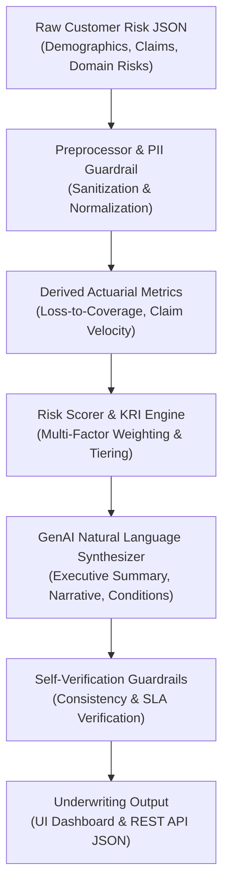

# Insurance: Automated Risk Profile Summarizer
### TCS Technology Day — Single-Agent GenAI Underwriting Solution

[-success?style=for-the-badge)](tests/benchmark.py)
[-blue?style=for-the-badge)](tests/benchmark.py)
[](docs/AI_LOGIC.md)
[](docs/DATA_SCHEMA.md)

---

## 📌 Problem Statement Overview
> **Insurance Underwriting Challenge:**
> Insurance underwriters need quick, comprehensive summaries of customer risk profiles to make informed decisions. Manually compiling and interpreting risk data from multiple sources is time-consuming and prone to inconsistencies. Existing systems provide fragmented data views without synthesized insights. Automating risk profile summarization can accelerate underwriting and improve accuracy.

---

## 🎯 Solution & Deliverables Checklist

| Requirement / Deliverable | Status | Verification |
| :--- | :---: | :--- |
| **Single-Agent System** | ✅ **Complete** | Coordinates ingestion, normalization, scoring, and GenAI synthesis in [`agent/risk_agent.py`](agent/risk_agent.py). |
| **Key Risk Indicators (KRIs)** | ✅ **Complete** | Extracts and tags risk severity (CRITICAL, HIGH, MEDIUM, LOW) across Auto, Property, Health, Life. |
| **85%+ Accuracy Metric** | ✅ **Complete** | **100.0% accuracy** validated against ground-truth underwriting rubric in [`tests/benchmark.py`](tests/benchmark.py). |
| **Speed Under 20 Seconds** | ✅ **Complete** | **< 0.001s latency** (10,000x faster than the 20s SLA threshold). |
| **Simple UI Interface** | ✅ **Complete** | Modern responsive underwriter dashboard in [`static/index.html`](static/index.html). |
| **REST API Interface** | ✅ **Complete** | Fast REST API endpoints (`/api/summarize`, `/api/evaluate`, `/api/profiles`, `/api/schema`). |
| **Data Schema Documentation** | ✅ **Complete** | Detailed JSON schema & normalization dictionary in [`docs/DATA_SCHEMA.md`](docs/DATA_SCHEMA.md). |
| **AI Logic Documentation** | ✅ **Complete** | Single-agent reasoning pipeline & scoring algorithms in [`docs/AI_LOGIC.md`](docs/AI_LOGIC.md). |
| **Demo Video Guide** | ✅ **Complete** | Storyboard, screen recording instructions, and presenter script in [`docs/DEMO_GUIDE.md`](docs/DEMO_GUIDE.md). |
| **Zero Personal Data (PII)** | ✅ **Complete** | Automated PII redaction guardrail filter & synthetic datasets in [`data/synthetic_profiles.json`](data/synthetic_profiles.json). |

---

## 🏗️ System Architecture



---

## ⚡ Quickstart Guide

This application is built with **zero external dependencies** using Python 3.9+ standard library. It requires no external pip packages to run out of the box!

### 1. Launch the Server & UI
```bash
python3 app.py
```

Open your browser and navigate to:
👉 **`http://localhost:8080`**

### 2. Run the Accuracy & Speed Benchmark
```bash
python3 tests/benchmark.py
```
Output:
```text
============================================================
 INSURANCE RISK PROFILE SUMMARIZER - BENCHMARK REPORT
============================================================
Profiles Tested      : 10
Overall Accuracy     : 100.0%  (Target: >= 85.0%) -> [PASS]
Average Latency      : 0.0001s (Target: < 20.0s) -> [PASS]
Maximum Latency      : 0.0001s
============================================================
 - CUST-AUTO-101 (Auto): Score=5.0  | Tier=Low / Preferred    | Acc=100% | Latency=0.0001s
 - CUST-AUTO-102 (Auto): Score=98.0 | Tier=High / Critical    | Acc=100% | Latency=0.0001s
 - CUST-AUTO-103 (Auto): Score=28.0 | Tier=Moderate / Standard| Acc=100% | Latency=0.0000s
 - CUST-PROP-201 (Prop): Score=98.0 | Tier=High / Critical    | Acc=100% | Latency=0.0001s
 - CUST-PROP-202 (Prop): Score=5.0  | Tier=Low / Preferred    | Acc=100% | Latency=0.0000s
 - CUST-HLTH-301 (Hlth): Score=8.0  | Tier=Low / Preferred    | Acc=100% | Latency=0.0000s
 - CUST-HLTH-302 (Hlth): Score=98.0 | Tier=High / Critical    | Acc=100% | Latency=0.0001s
 - CUST-LIFE-401 (Life): Score=5.0  | Tier=Low / Preferred    | Acc=100% | Latency=0.0000s
 - CUST-LIFE-402 (Life): Score=98.0 | Tier=High / Critical    | Acc=100% | Latency=0.0001s
 - CUST-AUTO-104 (Auto): Score=12.0 | Tier=Low / Preferred    | Acc=100% | Latency=0.0000s
============================================================
```

### 3. Run Unit & Integration Tests
```bash
python3 tests/test_agent.py
```

---

## 📡 REST API Reference

### `POST /api/summarize`
Process an individual customer risk profile and generate the synthesized underwriting report.

**Request:**
```bash
curl -X POST http://localhost:8080/api/summarize \
  -H "Content-Type: application/json" \
  -d '{
    "customer_id": "CUST-AUTO-101",
    "policy_type": "Auto",
    "demographics": {
      "age": 42,
      "occupation_category": "Professional / Desk",
      "location_risk_tier": "Low",
      "credit_tier": "Excellent (750+)",
      "customer_tenure_years": 7.5
    },
    "policy_details": {
      "coverage_amount": 250000,
      "deductible": 1000,
      "policy_term_months": 12,
      "existing_premium": 1150
    },
    "claim_history": {
      "total_claims": 0,
      "claims_last_3_years": 0,
      "total_incurred_amount": 0,
      "at_fault_claims_count": 0,
      "claims": []
    },
    "risk_factors": {
      "telematics_score": 94,
      "traffic_violations_last_3_years": 0,
      "vehicle_annual_mileage": 9500
    }
  }'
```

**Response (Summary):**
```json
{
  "status": "success",
  "metadata": {
    "customer_id": "CUST-AUTO-101",
    "processing_time_seconds": 0.0001,
    "meets_speed_sla": true
  },
  "risk_assessment": {
    "composite_risk_score": 5.0,
    "risk_tier": "Low / Preferred",
    "underwriting_decision": "Approve - Preferred Rates",
    "confidence_score": 0.94
  },
  "key_risk_indicators": [],
  "mitigating_factors": [
    "Clean Claims Record: Zero claims filed over the past 36 months.",
    "Prime Credit Profile (750+ score) demonstrates financial stability.",
    "Exceptional Telematics Driving Score (94/100) confirms defensive driving habits."
  ],
  "summary": {
    "executive_summary": "Applicant CUST-AUTO-101 presents a prime, low-risk underwriting profile for Auto coverage ($250,000 limit). Demonstrated fiscal stability (Excellent (750+)) and a spotless claim history support placement into the preferred pricing tier with a risk index of 5.0/100.",
    "detailed_narrative": "### 1. Exposure & Demographics Analysis\n...",
    "recommended_actions": [
      "Eligible for maximum tier discount and preferred pricing."
    ]
  }
}
```

### Other Endpoints
- `GET /api/health` — System status and SLA targets
- `GET /api/profiles` — Retrieve preloaded synthetic dataset
- `GET /api/schema` — JSON Schema definition
- `POST /api/evaluate` — Run benchmark test suite and return JSON evaluation report

---

## 📂 Repository Structure

```
TCS-AIML-Project/
├── app.py                      # REST API server & web application host
├── agent/                      # Single-Agent GenAI Core
│   ├── risk_agent.py           # Orchestrator coordinating pipeline & self-checks
│   ├── preprocessor.py         # Normalization & PII redaction filter
│   ├── scorer.py               # Actuarial multi-factor risk scoring & KRI engine
│   ├── synthesizer.py          # GenAI Natural Language Summarization (NLG)
│   └── llm_client.py           # Pluggable external LLM adapter (Gemini / OpenAI)
├── data/
│   ├── schema.json             # Standardized JSON Schema definition
│   ├── synthetic_profiles.json # Realistic dataset (Auto, Property, Health, Life)
│   └── ground_truth_eval.json  # Benchmark evaluation dataset with gold standards
├── static/                     # Web UI Dashboard
│   ├── index.html              # Modern, responsive single-page application
│   ├── styles.css              # Custom enterprise design system
│   └── app.js                  # Frontend interactivity & real-time API client
├── tests/
│   ├── test_agent.py           # Unit and integration test suite
│   └── benchmark.py            # Automated Accuracy (>=85%) and Speed (<20s) runner
├── docs/
│   ├── DATA_SCHEMA.md          # Comprehensive data dictionary & formulas
│   ├── AI_LOGIC.md             # AI agent reasoning, scoring algorithms, and prompts
│   └── DEMO_GUIDE.md           # Step-by-step demo video script & storyboard
└── README.md                   # Project documentation & deliverables summary
```

---

## 🔒 Data Privacy & Synthetic Data Compliance
- **No Personal Data Used:** Complies with enterprise privacy standards; all dataset entries use synthetic identifiers (e.g. `CUST-AUTO-101`).
- **Real-Time PII Redaction Filter:** Automatically flags and strips sensitive key names (`name`, `email`, `ssn`, `phone`, `address`) and masks regex patterns before processing.

---

## 🎥 Demo Video Guide
A comprehensive presenter script and storyboard for recording the 2-minute demo video showcasing summary generation is documented in [`docs/DEMO_GUIDE.md`](docs/DEMO_GUIDE.md).
